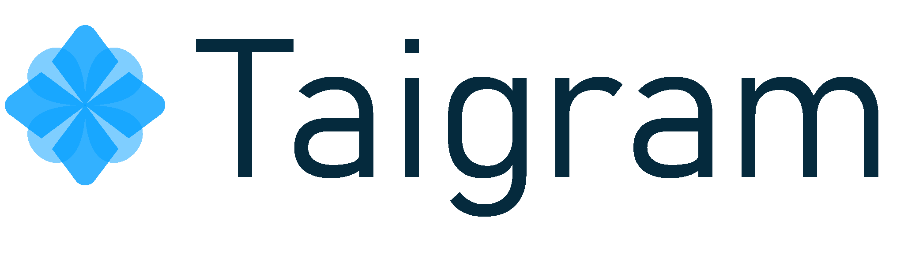

# Napkin Tools: Taigram (Taiga Telegram Notifier)

## [Русская версия](README-RU.md)

  

## Table of Contents

1. [About the Project](#about-the-project)
2. [Quick Start](#quick-start)
3. [Features](#features)
4. [Technologies](#technologies)
5. [Development](#development)
6. [Code Style](#code-style)
7. [Authors](#authors)
8. [License](#license)

## About the Project

*To be added later*

## Quick Start

*To be added later*

## Features

*To be added later*

## Technologies

*To be added later*

## Development

See detailed guidelines in [CONTRIBUTING.md](.github/CONTRIBUTING.md).
*Additional sections to be added later*

## Code Style

Refer to [STYLEGUIDE.md](.github/STYLEGUIDE.md).
*Updates to be added later*

## Authors

- **Development**:
  - [Ivan Ashikhmin](https://t.me/proDreams)
  - [Viktor Vangeli](https://t.me/VictorVangeli)
  - [Viktor Korolev](https://t.me/wiltort)
  - [Roman Shabrov](https://t.me/Rororoqadhehrbfn)
- **Design**:
  - [Evgenij Akopyan](https://t.me/SBTesla)

Developed as part of the **"Code on a Napkin"** project.

Website: https://pressanybutton.ru/
Telegram channel: https://t.me/press_any_button

## License

This project is licensed under the MIT License. See [LICENSE](LICENSE) for details.
